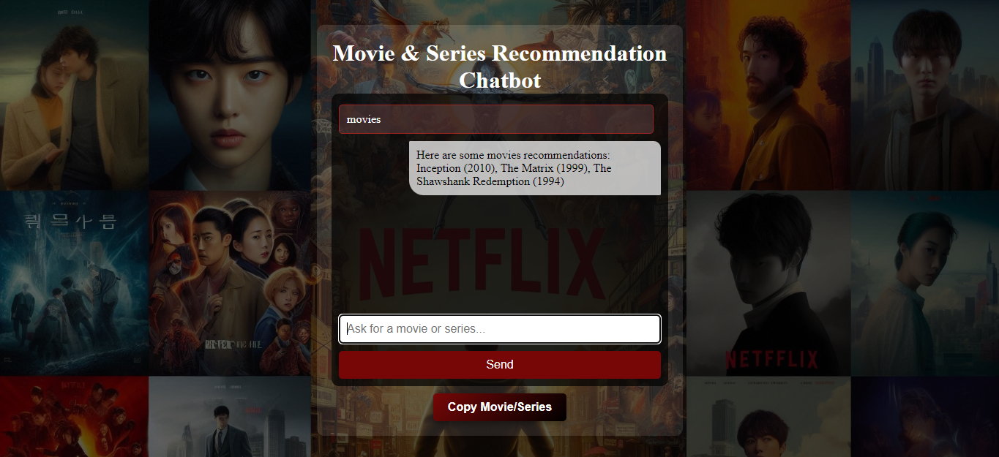

# Movie & Series Recommendation Chatbot

_Interactive Chatbot Interface showcasing real-time movie and series recommendations_

An intuitive chatbot that provides **real-time movie and series recommendations** based on user input. This chatbot is built using **HTML**, **CSS**, and **JavaScript**, offering suggestions based on genres, languages, and more. It’s designed with a **neumorphic and responsive user interface**, making it visually appealing and interactive across devices.

## Features
- **Real-Time Recommendations-** Get suggestions instantly for movies and series based on your input.
- **Multiple Languages & Genres-** Supports recommendations in English and Hindi across genres like Sci-Fi, Drama, Action, and more.
- **Responsive Design-** Optimized for both desktop and mobile devices, ensuring a seamless experience.
- **Copy to Clipboard Feature-** Effortlessly copy movie or series recommendations with a single click.
- **Stylish Neumorphic UI-** The design follows modern neumorphism principles for a polished look and feel.

## Technologies Used
- **HTML5-** for the structure and layout.
- **CSS3-** for responsive and neumorphic design.
- **JavaScript-** for handling chatbot interaction and recommendation logic.

## Future Enhancements
- **More Language Support-**: Extend recommendations to more languages beyond English and Hindi.
- **Dynamic Recommendations-**: Integrate external movie/series APIs (such as IMDb or TMDb) to provide real-time, dynamic suggestions based on the latest trends.
- **NLP Integration-**: Improve chatbot’s natural language understanding with NLP (Natural Language Processing) for better interaction and more human-like responses.
- **User Preferences-**: Add a feature to personalize recommendations based on the user’s viewing history or preferences.

